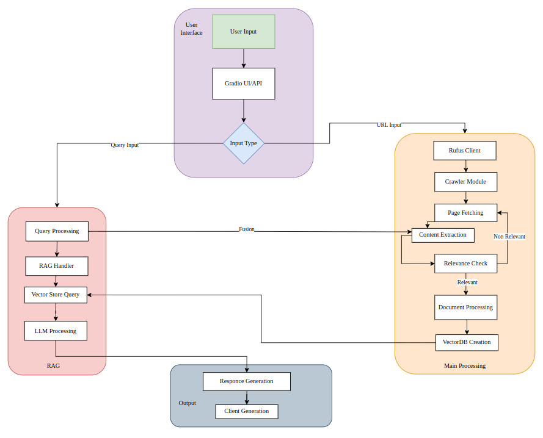
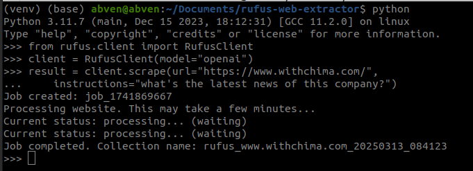
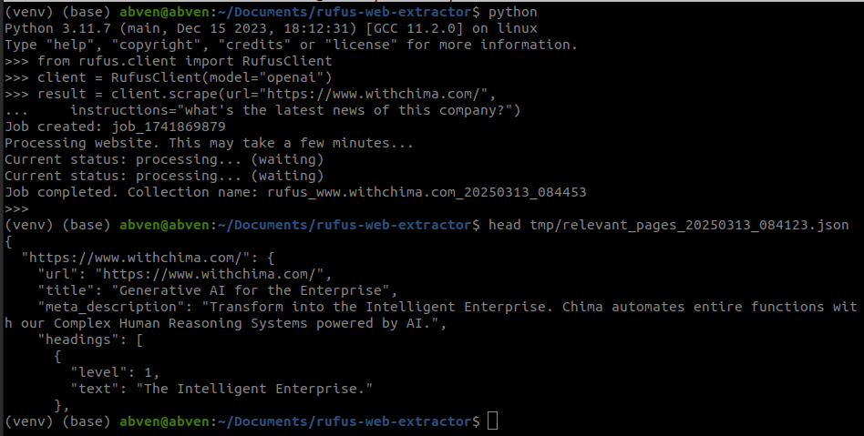
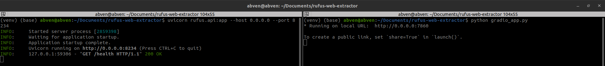
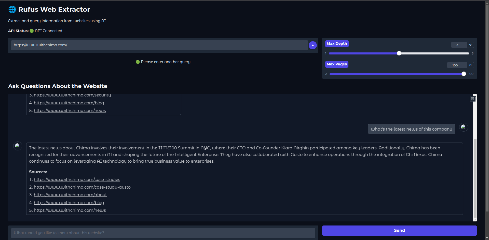
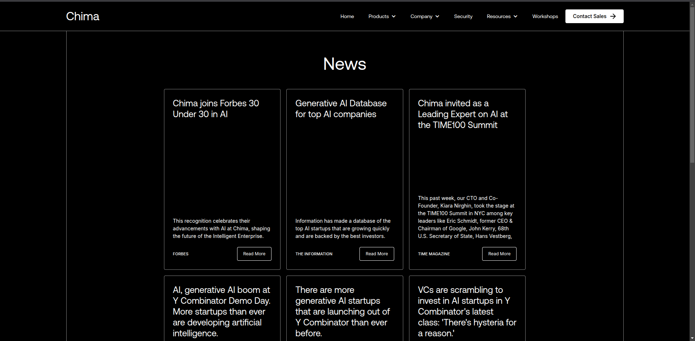

# Rufus Web Extractor

## 🌐 Project Overview

Rufus is an advanced AI-powered web data extraction tool designed for Retrieval-Augmented Generation (RAG) systems. It intelligently crawls websites, extracts relevant content, and prepares structured data for AI-driven applications.

## 🚀 Features

- Intelligent web crawling
- AI-powered content extraction
- Flexible configuration
- Support for multiple LLM models (Ollama, OpenAI)
- Gradio-based web interface
- FastAPI backend

## 🛠️ Prerequisites

- Python 3.10+
- pip
- virtualenv (recommended)

## 📦 Installation

### 1. Clone the Repository

```bash
git clone https://github.com/VenkateshRoshan/rufus-web-extractor.git
cd rufus-web-extractor
```

### 2. Create Virtual Environment

```bash
# For Windows
python -m venv venv
venv\Scripts\activate

# For macOS/Linux
python3 -m venv venv
source venv/bin/activate
```

### 3. Install Dependencies

```bash
# Upgrade pip
pip install --upgrade pip

# Install project dependencies
pip install -r requirements.txt

# Install the package in editable mode
pip install -e .
```

## 🔧 Configuration

### Environment Variables

Create a `.env` file in the project root:

```
# API Configuration
OPENAI_API_KEY=your_openai_key  # If using OpenAI
# to use ollama , edit config.yaml

# Logging and Debug
LOG_LEVEL=INFO
DEBUG=False
```

### Configuration File

Edit `rufus/config/config.yaml` to customize:
- Crawling parameters
- Model settings
- Logging options
- API configurations

## 🏃 Running the Application

### FastAPI Backend

```bash
uvicorn rufus.api:app --host 0.0.0.0 --port 8234
```

### Gradio Web Interface

```bash
# Option 1: Using Python
python gradio_app.py

# Option 2: Using console script
rufus-gradio
```

### Rufus Client
```bash
from rufus.client import RufusClient
client = RufusClient(model="openai")
result = client.scrape(url=url,
...     instructions=query)
```

## 🐳 Docker Deployment , haven't tested yet

### Build and Run

```bash
# Build the Docker image
docker build -t rufus-web-extractor .

# Run with Docker Compose
docker-compose up --build
```

## 🧪 Testing

### Run Tests

```bash
# Run all tests
pytest

# Run tests with coverage
pytest --cov=rufus

# Generate coverage report
pytest --cov=rufus --cov-report=html
```

### Test Configurations

- Test files are located in the `tests/` directory
- Uses `pytest` for testing
- Generates coverage reports

## 🔍 Development

### Code Quality Tools

```bash
# Run type checking
mypy rufus

# Format code
black rufus
```

## 📝 Logging

Logs are stored in the `logs/` directory. Configure logging levels in `config.yaml`.

## 🤝 Contributing

1. Fork the repository
2. Create your feature branch (`git checkout -b feature/AmazingFeature`)
3. Commit your changes (`git commit -m 'Add some AmazingFeature'`)
4. Push to the branch (`git push origin feature/AmazingFeature`)
5. Open a Pull Request

## 📋 Optional Dependencies

### Ollama Integration
```bash
# Install Ollama dependencies
pip install -e .[ollama]
```

### OpenAI Integration
```bash

# create .env file
touch .env

# inside of the .env file
OPENAI_API_KEY=API_KEY

# Install OpenAI dependencies
pip install -e .[openai]
```

# Architecture


# Outputs

## API output


```
The Job completed files will stored in output/rufus_results_rufus_www.withchima.com_20250313_084453.json

The full meta content, headers files will be saved in 
tmp/relevant_pages_20250313_084453.json
```



## Gradio Interface output




## 🛡️ Security

- Never commit sensitive information
- Use environment variables for secrets
- Regularly update dependencies

## 📜 License

Distributed under the MIT License. See `LICENSE` for more information.

## 🚨 Troubleshooting

- Ensure all dependencies are installed
- Check `.env` file configurations
- Verify API keys and endpoints
- Review logs in `logs/` directory

## 📞 Support

For issues or questions:
- Open a GitHub Issue
- Email: butchivenkatesh.a@gmail.com

---

**Happy Web Extracting! 🕷️🤖**